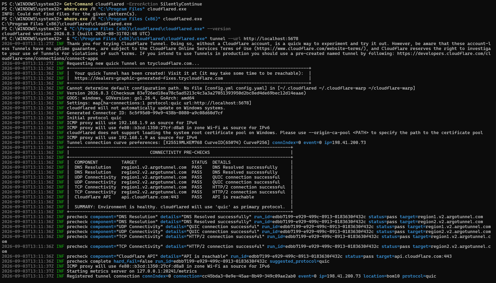

An AI-powered Recruitment Assistant built using **n8n, Ollama, Llama 3, Pinecone, and Retrieval-Augmented Generation (RAG)**.

The assistant uses **Llama 3** for generating responses and **nomic-embed-text** for converting candidate documents into vector embeddings.

##  Features

- AI-powered recruitment assistant using Llama 3
- Semantic search using nomic-embed-text embeddings
- Retrieval-Augmented Generation (RAG)
- Candidate document ingestion
- Vector database integration with Pinecone
- Local LLM and embedding model integration using Ollama
- Automated workflows using n8n
- Conversation memory for contextual interactions

## 🏗️ Document Ingestion Architecture

```text
Candidate Documents
        ↓
Default Data Loader
        ↓
nomic-embed-text
   (via Ollama)
        ↓
Pinecone Vector Database
```

## 🏗️ Recruitment Chat Architecture

```text
User Question
      ↓
n8n Chat Trigger
      ↓
AI Agent
  ├── Llama 3.2 (via Ollama)
  ├── Simple Memory
  └── Vector Store Search
          ↓
   Pinecone Vector Database
```
## 🛠️ Technologies Used

- **n8n** – Workflow automation and AI orchestration
- **Llama 3** – Large Language Model used for generating responses
- **nomic-embed-text** – Embedding model used to convert candidate information into vector representations
- **Ollama** – Local runtime used to run Llama 3 and the embedding model
- **Pinecone** – Cloud-based vector database for storing and retrieving embeddings
- **Docker** – Containerization of the n8n application
- **Cloudflare Tunnel** – Secure public access to the locally hosted n8n instance
- **RAG (Retrieval-Augmented Generation)** – Context-aware information retrieval and response generation

**Workflow Components**
### 1. Document Ingestion

Candidate documents are processed and converted into vector embeddings.

The workflow uses:

- Default Data Loader
- nomic-embed-text via Ollama
- Pinecone Vector Store

### 2. Recruitment Chat Assistant

Users can ask questions about candidates through a chat interface.

The workflow uses:

- n8n Chat Trigger
- AI Agent
- Llama 3 via Ollama
- Simple Memory
- Pinecone Vector Store

## 3. Deployment
The n8n instance is containerized using Docker.
Cloudflare Tunnel is used to securely expose the locally running application without traditional router port forwarding.

## 📸 Project Screenshots

### Document Ingestion Architecture


### Recruitment Chat Interface


### Candidate Form Submission


### Pinecone Vector Database


### Docker Deployment


### Cloudflare Tunnel



